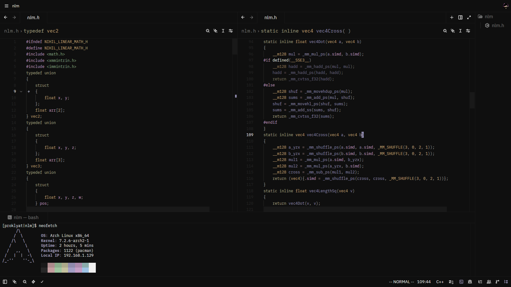

# Mountain for Zed

A port of the [Mountain](https://github.com/mountain-theme/Mountain) theme for the [Zed](https://zed.dev) editor, built on the **Fuji** color palette.

## Preview

  

## Installation

### From the Zed Extension Marketplace

1. Open Zed.
2. Open the command palette (`Cmd+Shift+P` on macOS, `Ctrl+Shift+P` on Linux/Windows).
3. Run `zed: extensions`.
4. Search for **Mountain** and click **Install**.
5. Open the theme selector (`theme selector: toggle` from the command palette) and choose **Mountain**.

### Manually

1. Clone this repository:

git clone https://github.com/xproklyatx/mountain-theme.git

2. Copy the theme file(s) into your Zed themes directory.

macOS / Linux:

cp themes/*.json ~/.config/zed/themes/

Windows:

copy themes\*.json $env:APPDATA\zed\themes\

3. Restart Zed and select **Mountain** from the theme selector.

## About

Mountain is a theme inspired by the muted, atmospheric tones of Mount Fuji. This port brings that same palette to Zed, aiming for a comfortable, low-contrast editing experience that stays readable during long sessions.

## Related

- **Original theme:** [mountain-theme/Mountain](https://github.com/mountain-theme/Mountain)
- **Zed editor:** [zed.dev](https://zed.dev)

## Contributing

Issues and pull requests are welcome. If you spot an inconsistency with the original theme or a color that doesn't look right in a particular language, feel free to open an issue.

## License
This project is licensed under the MIT License. It is a port of the [original Mountain theme](https://github.com/mountain-theme/Mountain), and the original copyright notice is preserved in the [LICENSE](LICENSE) file.
